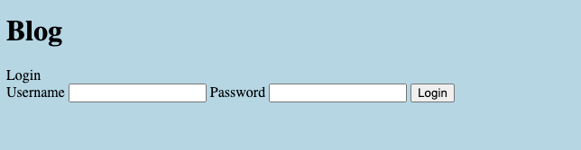

This project consists of
- an admin frontend
- a blog frontend
- 1 backend using Node.js

The focus of the blog frontend is to
- allow read posts/comment to post by anyone who visits

The focus of the admin frontend is to
- login/authenticate user
- protect resources
- persists login with JWT tokens, (up to 15 min)
- talk to backend api, allowing create/read/delete of posts on database
- only one person, the blog owner, can login

Database used: mongoDB

Model relationship
- There's 3 models, Comment, Post, and User
- A User can post any number of posts, a post belongs to one user
- A comment belongs to one post, a Post can have any number of comments

The admin frontend is for an admin user to write, delete, and publish blog posts

Technologies used: HTML, CSS, Typescript, Node.js, Snowpack web bundler

